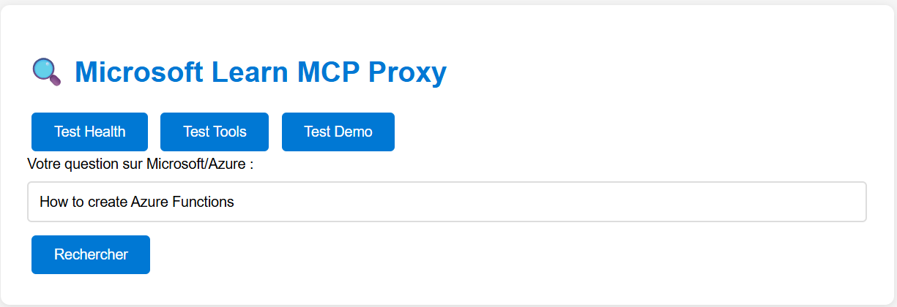

# MCP Microsoft Learn Proxy

> A production-ready proxy server for integrating Microsoft Learn documentation with Power Apps and Copilot Studio through MCP (Model Context Protocol).

## 🏗️ Architecture Overview

This proxy server acts as an intermediary between Power Apps/Copilot Studio and Microsoft Learn documentation, providing seamless access to official Microsoft documentation through a standardized API interface.

### Key Features

- **MCP Protocol Support**: Full compliance with Model Context Protocol standards
- **Microsoft Learn Integration**: Direct access to official Microsoft documentation
- **Power Apps Ready**: Pre-configured for Power Apps custom connectors
- **Copilot Studio Compatible**: Optimized for Microsoft Copilot Studio integration
- **Production Grade**: Built with enterprise-level reliability and security
- **CORS Enabled**: Cross-origin resource sharing configured for web applications

## 🚀 Quick Start

### Prerequisites

- Node.js 18.x or higher
- npm or yarn package manager
- Power Apps/Copilot Studio environment access

### Installation

```bash
# Clone or create the project
mkdir mcp-microsoft-learn-proxy
cd mcp-microsoft-learn-proxy

# Initialize the project
npm init -y

# Install dependencies
npm install express cors helmet morgan dotenv compression
npm install -D nodemon concurrently
```

### Project Structure

```text
mcp-microsoft-learn-proxy/
├── package.json              # Project dependencies and scripts
├── server.js                 # Main server implementation
├── .env                      # Environment variables
├── .gitignore               # Git ignore rules
├── test.js                  # Test suite
└── README.md                # This file
```

### Environment Configuration

Create a `.env` file in the root directory:

```env
PORT=3000
NODE_ENV=development
CORS_ORIGIN=*
LOG_LEVEL=info
```

### Starting the Server

```bash
# Development mode with auto-reload
npm run dev

# Production mode
npm start

# Run tests
npm test
```

### Interface de Test Web

Une fois le serveur démarré, vous pouvez accéder à l'interface de test à l'adresse :

```text
http://localhost:3000
```

L'interface propose plusieurs fonctionnalités de test :

#### 🏥 Test Health

Vérifie l'état du serveur et affiche les informations système :

```json
{
  "status": "OK",
  "service": "MCP Proxy for Microsoft Learn",
  "version": "1.0.0",
  "timestamp": "2025-07-04T18:30:11.006Z"
}
```

#### 🔧 Test Tools

Liste les outils MCP disponibles et leurs descriptions :

```json
{
  "result": {
    "tools": [{
      "name": "microsoft_docs_search",
      "description": "Search official Microsoft/Azure documentation..."
    }]
  }
}
```

#### 🎯 Test Demo

Interface de recherche interactive pour tester les requêtes :

- Saisissez votre question dans le champ de texte
- Cliquez sur "Rechercher"
- Visualisez les résultats en temps réel

**Exemple de recherche** : "How to create Azure Functions"
**Résultats** : 10 documents trouvés avec titres, descriptions et liens vers Microsoft Learn

Cette interface permet de valider le bon fonctionnement du proxy avant l'intégration avec Power Apps ou Copilot Studio.

## 🔌 Power Apps Integration

### Custom Connector Configuration

Power Apps nécessite une configuration spécifique en Swagger 2.0. Voici comment configurer le connecteur :

#### Option 1 : Configuration manuelle dans Power Apps

1. **Ouvrir Power Apps** → **Données** → **Connecteurs personnalisés**
2. **Créer un nouveau connecteur** → **Créer à partir de rien**
3. **Configuration générale** :
   - **Host** : `votre-serveur.com` (ex: `mcp-proxy.azurecontainerapps.io`)
   - **Schéma** : `https`
   - **Base URL** : `/`

4. **Définir les actions** :

**Action 1 - Recherche Documentation** :

- **Nom** : `SearchDocumentation`
- **Résumé** : `Rechercher dans Microsoft Learn`
- **ID d'opération** : `SearchDocumentation`
- **Visibilité** : `important`
- **URL** : `/search`
- **Verbe** : `POST`
- **Headers** : `Content-Type: application/json`
- **Corps de la demande** :

  ```json
  {
    "question": "string"
  }
  ```

**Action 2 - Health Check** :

- **Nom** : `HealthCheck`
- **URL** : `/health`
- **Verbe** : `GET`

#### Option 2 : Import Swagger 2.0

Créez un fichier `power-apps-connector.json` avec cette structure :

```json
{
  "swagger": "2.0",
  "info": {
    "title": "Microsoft Learn MCP Connector",
    "description": "Connecteur pour rechercher dans Microsoft Learn",
    "version": "1.0.0"
  },
  "host": "votre-serveur.com",
  "schemes": ["https"],
  "consumes": ["application/json"],
  "produces": ["application/json"],
  "paths": {
    "/search": {
      "post": {
        "summary": "Rechercher documentation",
        "operationId": "SearchDocumentation",
        "parameters": [{
          "name": "body",
          "in": "body",
          "required": true,
          "schema": {
            "type": "object",
            "properties": {
              "question": {
                "type": "string",
                "description": "Question à rechercher"
              }
            },
            "required": ["question"]
          }
        }],
        "responses": {
          "200": {
            "description": "Résultats trouvés"
          }
        }
      }
    }
  }
}
```

**Points clés pour Power Apps** :

- ✅ Utiliser **Swagger 2.0** (pas OpenAPI 3.0)
- ✅ Définir `operationId` pour chaque action
- ✅ Spécifier `consumes` et `produces`
- ✅ Corps de requête avec `schema` complet
- ✅ Host sans protocole (pas de `https://`)

### Copilot Studio Integration

1. **Create a new topic** in Copilot Studio
2. **Add a Power Automate flow** that calls your custom connector
3. **Configure the action** to use the `/search` endpoint
4. **Map the response** to your conversation flow

## 📊 API Endpoints

### Health Check

```http
GET /health
```

Returns server status and uptime information.

### Search Documentation

```http
POST /search
Content-Type: application/json

{
  "question": "How to create Azure Functions"
}
```

Returns relevant Microsoft Learn documentation.

### MCP Proxy

```http
POST /api/mcp
Content-Type: application/json

{
  "method": "search",
  "params": {
    "query": "Azure Functions tutorial"
  }
}
```

Direct MCP protocol endpoint for advanced integrations.

## 🧪 Testing

### Interface Web de Test

Accédez à `http://localhost:3000` pour utiliser l'interface de test interactive :



**Fonctionnalités disponibles** :

- **Test Health** : Vérification de l'état du serveur
- **Test Tools** : Liste des outils MCP disponibles  
- **Test Demo** : Interface de recherche interactive

### Tests Automatisés

```bash
npm test
```

### Tests Manuels via API

```bash
# Health check
curl http://localhost:3000/health

# Search test
curl -X POST http://localhost:3000/search \
  -H "Content-Type: application/json" \
  -d '{"question": "How to create Azure Functions"}'

# MCP protocol test
curl -X POST http://localhost:3000/api/mcp \
  -H "Content-Type: application/json" \
  -d '{"method": "search", "params": {"query": "Power Apps"}}'
```

### Résultats de Test Attendus

**Health Check** ✅

```json
{
  "status": "OK",
  "service": "MCP Proxy for Microsoft Learn",
  "version": "1.0.0",
  "timestamp": "2025-07-04T18:30:11.006Z"
}
```

**Recherche Demo** ✅  

- 10 résultats trouvés pour "How to create Azure Functions"
- Liens directs vers Microsoft Learn
- Descriptions détaillées et extraits de contenu

## 🚀 Deployment

### Azure App Service

```bash
# Login to Azure
az login

# Create resource group
az group create --name mcp-proxy-rg --location "East US"

# Create app service plan
az appservice plan create --name mcp-proxy-plan --resource-group mcp-proxy-rg --sku B1 --is-linux

# Create web app
az webapp create --resource-group mcp-proxy-rg --plan mcp-proxy-plan --name your-mcp-proxy --runtime "NODE|18-lts"

# Deploy
az webapp deployment source config-zip --resource-group mcp-proxy-rg --name your-mcp-proxy --src deploy.zip
```

### Heroku

```bash
# Install Heroku CLI
npm install -g heroku

# Login and create app
heroku login
heroku create your-mcp-proxy

# Deploy
git push heroku main
```

### Docker

```dockerfile
FROM node:18-alpine

WORKDIR /app
COPY package*.json ./
RUN npm ci --only=production

COPY . .
EXPOSE 3000

CMD ["npm", "start"]
```

## 🔧 Configuration

### Environment Variables

| Variable | Description | Default |
|----------|-------------|---------|
| `PORT` | Server port | `3000` |
| `NODE_ENV` | Environment mode | `development` |
| `CORS_ORIGIN` | CORS allowed origins | `*` |
| `LOG_LEVEL` | Logging level | `info` |

### Security Headers

The server automatically applies security headers:

- `X-Content-Type-Options: nosniff`
- `X-Frame-Options: DENY`
- `X-XSS-Protection: 1; mode=block`
- `Strict-Transport-Security` (HTTPS only)

## 📈 Monitoring

### Health Monitoring

The `/health` endpoint provides:

- Server uptime
- Memory usage
- System status
- Version information

### Logging

Structured logging with different levels:

- `error`: Error conditions
- `warn`: Warning conditions
- `info`: General information
- `debug`: Debug information

## 🤝 Contributing

1. **Fork** the repository
2. **Create** a feature branch (`git checkout -b feature/amazing-feature`)
3. **Commit** your changes (`git commit -m 'Add amazing feature'`)
4. **Push** to the branch (`git push origin feature/amazing-feature`)
5. **Open** a Pull Request

## 📄 License

This project is licensed under the MIT License. See the [LICENSE](LICENSE) file for details.

## 🆘 Support

For issues and questions:

- **GitHub Issues**: [Report a bug or request a feature](https://github.com/your-username/mcp-microsoft-learn-proxy/issues)
- **Documentation**: [Microsoft Learn MCP Integration Guide](https://learn.microsoft.com)
- **Community**: [Microsoft Power Platform Community](https://powerusers.microsoft.com)

## 🔗 Related Resources

- [Microsoft Learn Documentation](https://learn.microsoft.com)
- [Power Apps Custom Connectors](https://docs.microsoft.com/power-apps/maker/canvas-apps/register-custom-api)
- [Copilot Studio](https://docs.microsoft.com/microsoft-copilot-studio)
- [MCP Protocol Specification](https://modelcontextprotocol.io)

---

Made with ❤️ for the Microsoft Power Platform community
